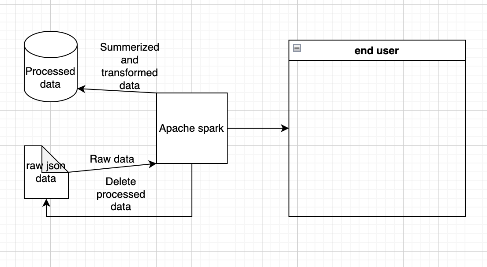

# Brugsanvisning

I src/test/scala/DemoTest.scala er der et eksempel hvor koden bliver kaldt med evironment variable. Kør denne test og husk at indsætte en valid api-nøgle som environment variabel.

# Arkitektur

Hvis jeg har forstået CQRS principperne korrekt vil dette være mit forslag til en arkitektur.

Som jeg forstår principper vil man lave beregninger drypvist som brugeren efterspørger dem. Derefter gemme dem så det ikke behøver at laves igen, og slette den underligger rådata da det er blevet behandlet. Derved bruger man kun den nødvendige computerekraft som brugeren efterspørger, og kun på nye efterspørglser, og man sparer plads ved at slette gammelt data.

